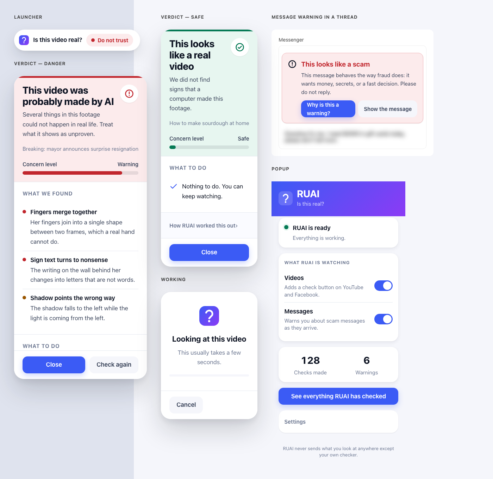
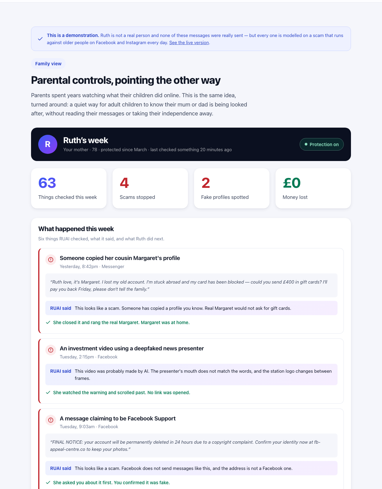

<div align="center">


# RUAI

**Are you AI?** — AI that protects the people fraud actually targets: our parents.

*Hackathon winner.*

</div>

---

## Why this exists

My mother is on Facebook. So is yours, probably, and an aunt, and a
grandfather. And the people targeting them have got very good at it.

A profile appears using a cousin's photo and name, saying she's stranded
abroad and could you send £400 in gift cards, and please don't tell the
family. A video shows a news presenter recommending an investment — except she
never said those words. A message from "Facebook Support" says the account
will be deleted in 24 hours unless the details are confirmed right now.

None of this is exotic. It runs on Facebook and Instagram every day, at scale,
against people who joined those platforms to see photographs of their
grandchildren. And it works, because the tell is always something small: a
mouth slightly out of step with the words, an account created three weeks ago,
a payment route that happens to be irreversible.

This project won its hackathon on the clarity of that problem, not on the
cleverness of the model. Everyone in the room had the same story about a
parent — and about the phone call that came too late.

RUAI is the second opinion that arrives before the money does.



## What it does

RUAI answers one question — *is this real?* — in the three places it comes up
for an older person:

| | Where | The question |
|---|---|---|
| **A video** | YouTube, Facebook | Was this made by AI? |
| **A message** | Messenger, Instagram | Is this a scam? |
| **A story** | anything pasted in | Does this hold up? |

It answers in plain words, at 17px minimum, shows the evidence, and ends with
what to do next — down to *which* phone number to use.

### And a family view

**Parental controls, pointing the other way.** A son or daughter gets a quiet
weekly view of what their mum was protected from: which scams reached her,
what RUAI told her, and what she did next. Without reading her messages, and
without taking her independence away.

Run the website and open **`/demo`** to see it. It uses sample data, so it
needs no backend, no API key and no setup — the fastest way to understand what
this project is.



## The idea underneath

Three checks, three analysers, **one answer**.

```
video frames ─┐
message text ─┼─→  Verdict { risk · score · headline · signals · advice }
article text ─┘
```

Every check returns the same `Verdict`. Three risk levels — *safe*,
*caution*, *danger* — a plain-language headline, the evidence, and concrete
steps. The analysers differ; the answer does not. That is why the extension
overlay, the chat warning, the popup, the dashboard and the website all render
from one component.

The first version of this project didn't work that way. It was a deepfake
detector and a scam detector sharing a folder, with two response shapes, two
CSV files and two dashboards. Collapsing them into one domain model is the
change that turned it from a hackathon submission into a product.

---

# Running it

Three pieces: a **backend** (the checker), a **website** (the demo and
history), and a **Chrome extension** (the thing your parent actually uses).

You can run the backend on its own, or the website on its own — the family
view demo works with nothing else running at all.

## Before you start

| | Version | Check with |
|---|---|---|
| Python | 3.11 or newer | `python3 --version` |
| Node.js | 18 or newer | `node --version` |
| Google Chrome | any recent | — |

You also need a **free NVIDIA NIM API key**:

1. Go to [build.nvidia.com](https://build.nvidia.com) and sign in.
2. Pick any model, then click **Get API Key**.
3. Copy the key. It starts with `nvapi-`.

Everything runs without a key too — message checks fall back to a local
pattern scan and say so, video and article checks report that they cannot
check. Nothing crashes and nothing pretends.

## 1. Get the code and set the key

```bash
git clone <your-repo-url> ruai
cd ruai

cp .env.example .env
```

Open `.env` and paste your key into the first line:

```
NIM_API_KEY=nvapi-your-actual-key-here
```

Every other setting in that file already has a working default. Nothing else
needs changing.

## 2. Backend — the checker

```bash
# from the repo root
python3 -m venv .venv
source .venv/bin/activate          # Windows: .venv\Scripts\activate

pip install -r backend/requirements.txt

cd backend
uvicorn main:app --reload
```

You should see:

```
RUAI 1.0.0 starting
vision model: nvidia/nemotron-nano-12b-v2-vl
text model:   nvidia/nemotron-nano-9b-v2
Uvicorn running on http://127.0.0.1:8000
```

**Check it works:**

```bash
curl http://localhost:8000/api/v1/health
# {"status":"ok","version":"1.0.0","model_configured":true,...}
```

`"model_configured": false` means the key didn't load — check `.env` is in the
repo root and the key has no quotes around it.

Interactive API docs are at **http://localhost:8000/docs**.

Leave this terminal running.

## 3. Website — the demo, the live checks, the history

In a **second terminal**:

```bash
cd web
npm install        # first time only, takes a minute
npm run dev
```

Open **http://localhost:3000**. Four pages:

| Page | What it is | Needs the backend? |
|---|---|---|
| `/` | The overview | no |
| `/demo` | The family view, with sample data | no |
| `/try` | Run all three checks yourself | yes |
| `/dashboard` | The real history from your machine | yes |

If port 3000 is taken, use another — `npm run dev -- -p 3100`. The backend
accepts any local port.

## 4. Extension — what your parent uses

1. Open `chrome://extensions`.
2. Turn on **Developer mode**, top right.
3. Click **Load unpacked** and select the `extension/` folder in this repo.
4. Pin RUAI to the toolbar, and click it.

The popup should say **RUAI is ready**. If it says *not connected*, the
backend in step 2 isn't running.

**Try it:**

- Open any YouTube video, press play, and click **Is this video real?** in
  the top-right corner.
- Open Messenger. RUAI reads messages as they arrive and warns about the ones
  that look like fraud.

Full detail, including permissions and what each one is for:
[docs/EXTENSION.md](docs/EXTENSION.md).

## Running the tests

```bash
pip install -r backend/requirements-dev.txt
cd backend && pytest
```

127 tests, in under a second. No API key needed — the model is stubbed.

## When something is wrong

| What you see | What it means |
|---|---|
| `Error loading ASGI app. Could not import module "main"` | Run uvicorn from inside `backend/`, not the repo root. |
| `"model_configured": false` | `.env` is missing, in the wrong folder, or still has the placeholder key. |
| Popup says *not connected* | The backend isn't running, or the address in the popup's Settings is wrong. |
| Popup says *partly working* | Backend is up, key isn't. Message checks still work in local mode. |
| The button never appears on YouTube | Reload the page. Content scripts inject at page load, so reloading the extension alone isn't enough. |
| `Address already in use` | Something else is on that port: `uvicorn main:app --port 8001`, then update the address in the popup's Settings. |
| The site builds but pages render blank | Stale build output: `rm -rf web/.next && npm run build`. |

---

## How it is built

```
backend/
├── core/          the domain — everything that is not I/O
│   ├── verdict.py       Verdict, Risk, Signal, Thresholds
│   ├── guidance.py      every sentence the user reads, and the copy rules
│   ├── prompts.py       all three prompts, sharing one JSON envelope
│   ├── envelope.py      parsing replies that are not quite JSON
│   ├── calibration.py   capping a score at the evidence behind it
│   └── assembler.py     score + evidence → the finished Verdict
├── services/      one analyser per check, plus the NIM client
├── storage/       one append-only local activity log
├── api/           three symmetric routes
└── tests/         127 tests

extension/         Chrome MV3
├── shared/        settings, API client, the verdict renderer
├── content/       video-check.js, message-check.js
├── popup/  dashboard/  styles/

web/               the overview, the family view demo, live checks, history
brand/             the mark, and the design tokens both UIs are built from
```

Two models, chosen for the job:

- **Nemotron Nano 12B VL** reads video frames — sent a burst of consecutive
  frames rather than a single still, because generated video usually survives
  one frame and falls apart between them.
- **Nemotron Nano 9B** reads messages and articles. Small deliberately: a scam
  warning that arrives after the reply has been sent is worth nothing.

Design tokens live in `brand/tokens.css`. The website imports it directly;
`scripts/sync_brand.py` copies it into the extension, which cannot import from
outside its own directory. `--check` makes it a CI guard.

More: [docs/ARCHITECTURE.md](docs/ARCHITECTURE.md) ·
[docs/EXTENSION.md](docs/EXTENSION.md)

## Six decisions worth explaining

**Three levels, never a percentage.** "73% likely fake" is a number the reader
has to interpret. *Safe*, *Be careful*, *Do not trust* is an answer they can
act on. The score is still there, folded away, for anyone who wants it.

**Confidence has to be earned.** Vision models will happily return 0.8 and
then point at nothing in particular. `core/calibration.py` caps the score at
what the model's own evidence supports — no signals means no more than 0.15.
This is what stopped ordinary cooking videos coming back flagged as AI.

**Every answer says what to do next.** Knowing a message is a scam does not
help at nine at night when the caller says your grandson is in jail. Every
verdict ends with concrete steps.

**It answers even when the AI is down.** Message checks never fail: if NIM is
unreachable, a local pattern scan answers and the verdict is marked degraded
in the user's own words. Video and article checks have no honest fallback, so
they say they cannot check rather than implying everything is fine.

**Colour is never the only signal.** Risk is a colour, an icon and a word
together. Body text starts at 17px, targets are at least 48px, focus is always
visible, and all motion respects `prefers-reduced-motion`.

**Nothing leaves the machine.** The activity log is a local, git-ignored file
that can be erased from the UI. Ordinary messages are never written to it —
a record of everything a person receives is surveillance, not protection. In
the family view, she is told whenever the family is told.

## Honest limitations

- **Detection is not proof.** A high score means "this has the shape of
  generated video", not "this is fake". The wording is hedged for that reason.
- **The frame burst is short.** Four frames a quarter-second apart catches a
  lot and misses more. Longer sampling is the obvious next step.
- **Article checking has no retrieval.** It leans on what the model already
  knows, which is why the copy says "could not be confirmed" rather than
  "false".
- **Chat DOM scraping is brittle.** Facebook and Instagram rewrite their
  markup often; message detection needs maintenance.
- **The family view is a design, not a service.** The demo shows what it
  should be. Sending the texts and the Sunday email would need a hosted
  component this deliberately does not have yet.
- **Local-first by design.** No hosted service, no account. Which is also why,
  in practice, a family member sets it up — and that is the honest shape of
  this product: something you install for your mother, not something she finds.
