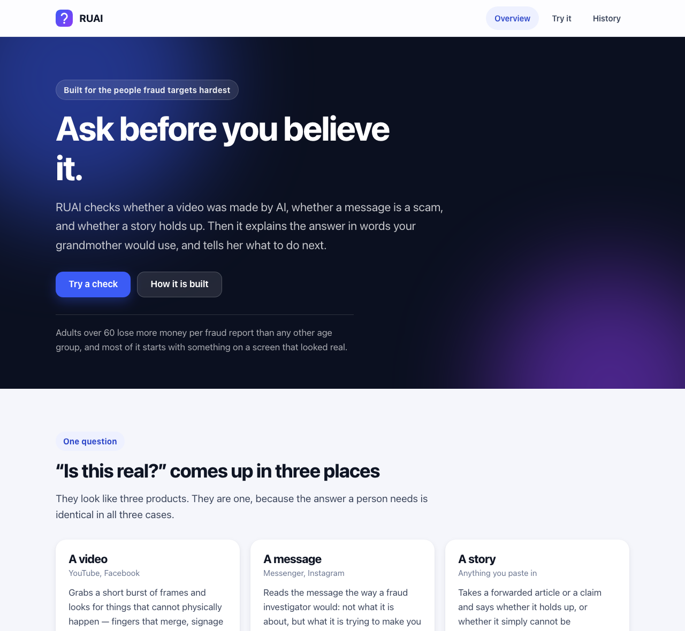

<div align="center">


# RUAI

**Are you AI?** — a second opinion on anything that looks real online,
written for the people fraud targets hardest.

</div>

---

RUAI answers one question — *is this real?* — in the three places it comes up:

| | | |
|---|---|---|
| **A video** | YouTube, Facebook | Was this made by AI? |
| **A message** | Messenger, Instagram | Is this a scam? |
| **A story** | anything pasted in | Does this hold up? |

It answers in plain words, shows the evidence, and ends with what to do next.

It is built for people in their seventies and eighties. Adults over 60 lose
more money per fraud report than any other age group, and almost all of it
starts with something on a screen that looked real. That audience shaped every
decision below — the reading level, the type size, the refusal to print a
percentage, and the rule that a warning has to arrive even when the AI is down.


## The idea

Three checks, three analysers, **one answer**.

```
video frames ─┐
message text ─┼─→  Verdict { risk · score · headline · signals · advice }
article text ─┘
```

Every check returns the same `Verdict`. Three risk levels — *safe*, *caution*,
*danger* — a plain-language headline, the evidence behind it, and concrete next
steps. The analysers differ; the answer does not. That is why the extension
overlay, the message warning, the popup, the dashboard and this repo's website
all render from one component.

The previous version of this project did not work that way. It was a deepfake
detector and a scam detector sharing a folder, with two response shapes, two
CSV files and two dashboards. Collapsing them into one domain model is the
change that turned it from a hackathon submission into a product.

## Quick start

**You need:** Python 3.11+, Node 18+, Chrome, and a free
[NVIDIA NIM](https://build.nvidia.com) API key.

```bash
cp .env.example .env          # then paste your NIM key into NIM_API_KEY

# 1. Backend
python -m venv .venv && source .venv/bin/activate
pip install -r backend/requirements.txt
cd backend && uvicorn main:app --reload      # http://localhost:8000/docs

# 2. Website  (in a second terminal)
cd web && npm install && npm run dev         # http://localhost:3000

# 3. Extension
#    chrome://extensions → Developer mode → Load unpacked → select extension/
```

Then open any YouTube video and press **Is this video real?**, or open
`http://localhost:3000/try` to check a message without leaving the browser.

Without a NIM key everything still runs: message checks fall back to a local
pattern scan and say so; video and article checks report that they cannot
check right now rather than guessing.

## How it is built

```
backend/
├── core/          the domain — everything that is not I/O
│   ├── verdict.py       Verdict, Risk, Signal, Thresholds
│   ├── guidance.py      every sentence the user reads, and the copy rules
│   ├── prompts.py       all three prompts, sharing one JSON envelope
│   ├── envelope.py      parsing replies that are not quite JSON
│   ├── calibration.py   capping a score at the evidence behind it
│   └── assembler.py     score + evidence → the finished Verdict
├── services/      one analyser per check, plus the NIM client
├── storage/       one append-only local activity log
├── api/           three symmetric routes
└── tests/         117 tests

extension/         Chrome MV3
├── shared/        settings, API client, the verdict renderer
├── content/       video-check.js, message-check.js
├── popup/  dashboard/  styles/

web/               Next.js — the case for the project, a live demo, the history
brand/             the mark, and the design tokens both UIs are built from
```

Two model calls, chosen for the job:

- **Nemotron Nano 12B VL** reads video frames. Sent a burst of consecutive
  frames rather than one still, because generated video usually survives a
  single frame and falls apart between them.
- **Nemotron Nano 9B** reads messages and articles. Small deliberately: a scam
  warning that arrives after the reply has been sent is worth nothing.

Design tokens live in `brand/tokens.css`. The web app imports that file
directly; `scripts/sync_brand.py` copies it into the extension, which cannot
import from outside its own directory. `--check` makes it a CI guard.

More detail: [docs/ARCHITECTURE.md](docs/ARCHITECTURE.md) ·
[docs/EXTENSION.md](docs/EXTENSION.md)

## Six decisions worth explaining

**Three levels, never a percentage.** "73% likely fake" is a number the reader
has to interpret. *Safe*, *Be careful*, *Do not trust* is an answer they can
act on. The score is still there, folded away, for anyone who wants it.

**Confidence has to be earned.** Vision models will happily return 0.8 and then
point at nothing in particular. `core/calibration.py` caps the score at what
the model's own evidence supports — no signals means no more than 0.15. This is
what stopped ordinary cooking videos coming back flagged as AI.

**Every answer says what to do next.** Knowing a message is a scam does not
help at nine at night when the caller says your grandson is in jail. Every
verdict ends with concrete steps, down to *which* phone number to use.

**It answers even when the AI is down.** Message checks never fail: if NIM is
unreachable, a local pattern scan answers and the verdict is marked degraded in
the user's own words. Video and article checks have no honest fallback, so they
say they cannot check rather than implying everything is fine.

**Colour is never the only signal.** Risk is a colour, an icon and a word
together. Body text starts at 17px, targets are at least 48px, focus is always
visible, and all motion respects `prefers-reduced-motion`.

**Nothing leaves the machine.** The activity log is a local, git-ignored file,
and it can be erased from the UI. Ordinary messages are never written to it at
all — a record of everything a person receives is surveillance, not protection.

## Tests

```bash
pip install -r backend/requirements-dev.txt
cd backend && pytest
```

117 tests, written around the failure modes that make a detector untrustworthy
rather than broken:

- a confident model with no evidence must not produce a warning
- `"know"` must not match the urgency keyword `"now"`
- an unreadable model reply must never be read as "looks real"
- a message check must still answer when NIM is down, and admit it degraded
- ordinary messages must not reach the activity log

They also hold the user-facing copy to its rules: no exclamation marks, no
sentence longer than two clauses, and a headline and advice list present for
every combination of check and risk level.

## Honest limitations

- **Detection is not proof.** A high score means "this has the shape of
  generated video", not "this is fake". The wording throughout is deliberately
  hedged for that reason.
- **The frame burst is short.** Four frames a quarter-second apart catches a
  lot and misses more. Longer sampling is the obvious next step.
- **Article checking has no retrieval.** It leans on what the model already
  knows, which is why the copy says "could not be confirmed" rather than
  "false".
- **Chat DOM scraping is brittle.** Facebook and Instagram rewrite their
  markup often; message detection needs maintenance to keep working.
- **Local-first by design.** There is no hosted service and no account. The
  backend runs on the user's own machine, which is also why a family member
  usually has to set it up.

<div align="center">

</div>
